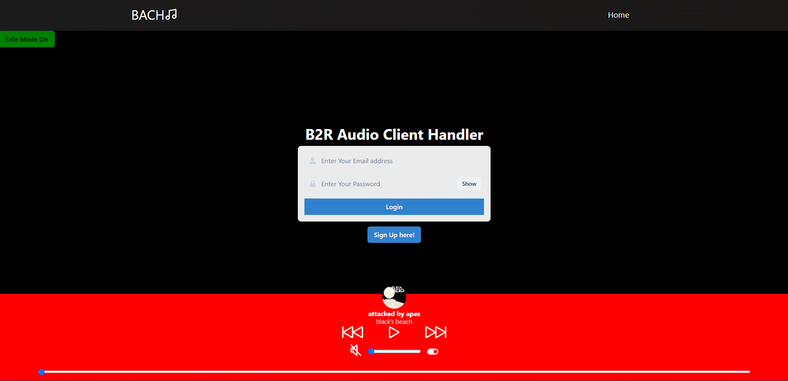
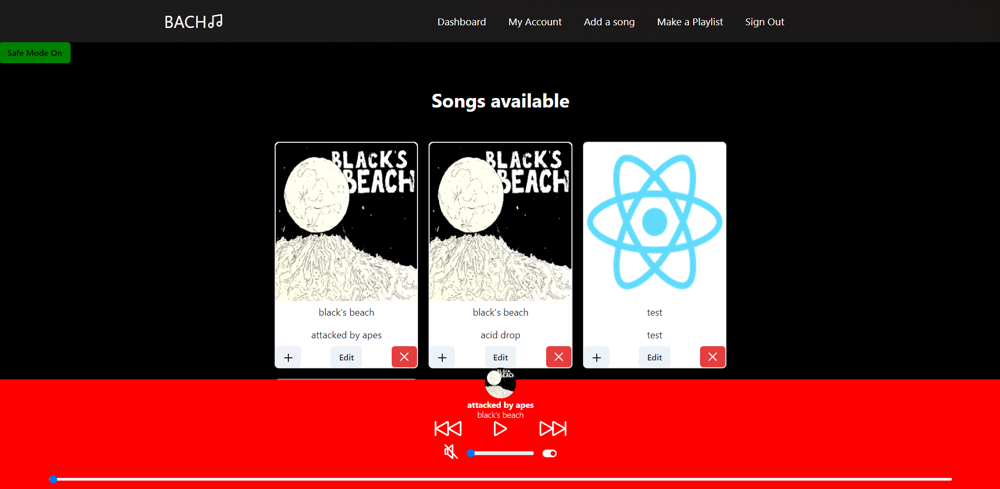

# BACH

## Description
B2R Audio Client Handler (BACH) is a simple music player where users can create an account and can contribute to the music player by uploading songs.

## Deployed Website
[Website](http://164.90.135.34/)

## Table of Contents
* [Installation](#installation)
* [Usage](#usage)
* [Contributors](#contributors)

## Installation
To install this application, clone this repository onto your local machine then run the following commands: `npm install`, `npm run seed`, then `npm run develop`. The following commands will install the required techonologies needed to run this application and will run the database with its server. 

## Usage
When the application is running, the home page will display the navigation bar, the login/signup page, and the sound player at the bottom of the page. In order add songs and create playlists, you must login or create an account. After logging in, you will be let the the dashboard where you will see a list of songs available to add to your playlists. You can add songs by clicking the `Add a Song`. After uploading a song and noticing that something is mispelled, you can edit the song details by clicking the `Edit` button underneath the song card. You can also make a playlist by clicking the `Make a Playlist button`, and your playlists will be available on the `My Account` modal and the `Add to Playlist (+)` button on each song. Finally, you are able to delete a song by clicking the red `X` button below the song. 

* Homepage

* Dashboard

## Contributors
* [Will](github.com/swillswindle)
* [Jesse](github.com/jmaraya1229)
* [Trent](github.com/Tkachuk94)
* [Mitchel](github.com/MitchellM27)

## License
This repository is licensed under the MIT License.